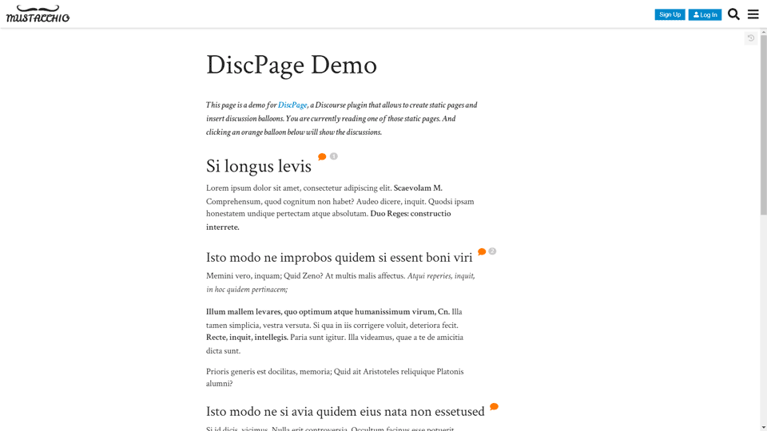
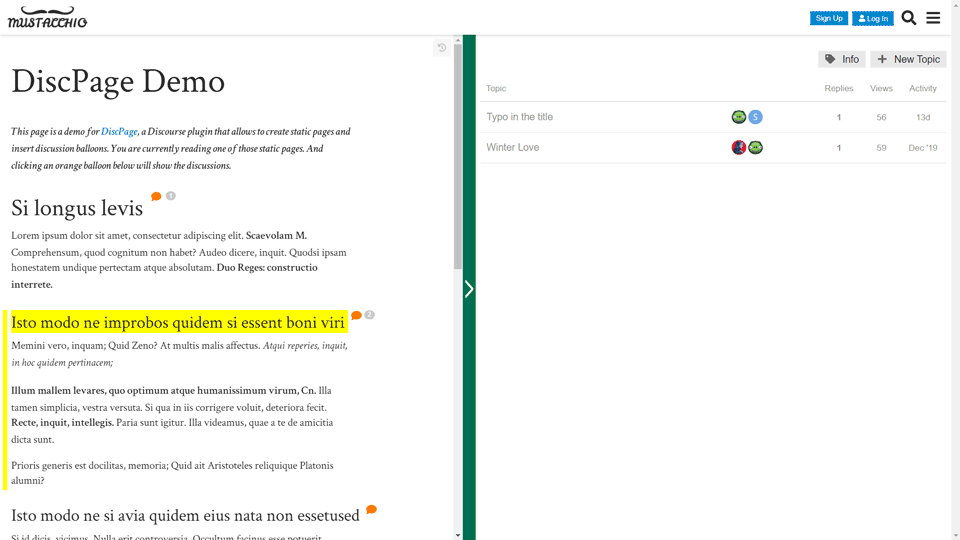
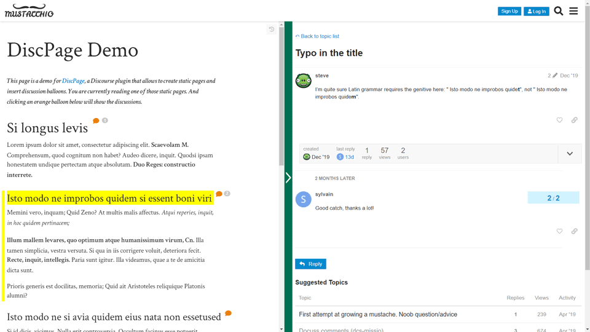

# DiscPage

A Discourse plugin to create static pages and insert discussion balloons in the text.

To discuss this plugin, see the [post on Meta](https://meta.discourse.org/t/discpage-a-plugin-to-create-static-pages-and-insert-discussion-balloons-in-the-text/136841).

## Demo

Basic static page: http://www.docuss.org/t/discpage-demo

Full website: https://www.castafiore.org

## Screenshots

A static page:


A static page with a balloon's right panel showing a topic list:


A static page with a balloon's right panel showing a discussion:


## Installation

Follow
[those directions](https://meta.discourse.org/t/install-plugins-in-discourse/19157)
using `https://github.com/sylque/discpage.git` as the repository URL.

## Basic Setup

### 1. Create a category for static pages

DiscPage requires that you create at least one category for holding static
pages. You can learn how to create a category in
[this tutorial](https://discourseengine.com/blog/create-new-category-discourse/).

Set the category parameters as follow:

- `General` tab / `Category Name` &rightarrow; _Page_ (for example)
- `Security` tab / `Edit Permissions` &rightarrow;
  - remove line `everyone can… Create / Reply / See`
  - add line `admins can… Create / Reply / See`
  - add line `everyone can… See`

### 2. Set those Discourse settings

In the Discourse Admin panel, open the Settings page and set:

- `tagging enabled` &rightarrow; checked
- `discpage enabled` &rightarrow; checked
- `discpage page categories` &rightarrow; [static page category created above]

If your Discourse instance doesn't use tags (i.e. if `tagging enabled` was
unchecked before you checked it as part of the above setup), set:

- `discpage hide tags` &rightarrow; checked

### 3. My hamburger menu has turned red, what should I do?


A red hamburger menu means that **DiscPage is disabled**. This occurs:
1. when an error has prevented DiscPage from starting (in that case, check the
  debug console for a DiscPage-related error), and
2. when you manually turn DiscPage off (see below).

## Creating and managing static pages

When **logged-in as admin**, you can perform the following actions:

- To **create a static page**, add the static page category to a topic: the
  initial post of the topic will be turned into a static page.

- To **edit a static page**, click the "pencil" button at the top right of the
  static page (you can also turn DiscPage off from the hamburger menu, then edit
  the topic as you would do normally).

- To **style static pages**, use the `.dpg-page-content` class. To style an
  individual page, use the `html[data-dpg-page-id]` data attribute. For example,
  go to `Settings > Customize > Light Theme > Edit CSS/HTML` and enter the 
  following in the `Common > CSS` section:
  ```css
  /* This will turn text to red in all static pages */
  .dpg-page-content {
    color: red;
  }

  /* This will turn text to yellow in static page 13 */
  html[data-dpg-page-id="13"] .dpg-page-content {
    color: yellow;
  }
  ```

- To **add JavaScript to a static page**, use the `dpg_displaypage` DOM custom event
  on the `<html>` tag. For example, you can add this code to a theme component's 
  `</head>` section:

  ```
  <script>
    document.documentElement.addEventListener('dpg_displaypage', e => {
      const pageData = e.detail 
      if (pageData.pageId === 19) {
        $(pageData.node).find('.cooked').append('
          <p>This paragraph has been dynamically added!</p>'
        )
      }
    }, false);
  </script>  
  ```

## Adding discussion balloons to a static page

To add a balloon, add `[dpgb id=myBalloonId][/dpgb]` to your topic text. For
example:

```
## Introduction [dpgb id=intro][/dpgb]
```

The balloon id must contain only [a-zA-z_]. Unless you know what you're doing, 
it should be **unique to the page**.

When adding a balloon **to a heading**, selecting the balloon will highlight
both the heading and the following subsection.

To append a balloon to the page title, add `{dpg-title-balloon}`
anywhere in the page. The balloon id will be `title`.

## Other features

### Turn DiscPage off temporarily

At any time, if you need to see your website _without_ DiscPage, use the
`DiscPage On/Off` item in the hamburger menu. This comes handy when 
troubleshooting issues with tags or categories. When turning DiscPage off, 
the hamburger menu turns red (see above).

Keyboard shortcut: alt+a

### Home Page

To set a static page as the Discourse home page, use the
[discourse-home-page](https://github.com/sylque/discourse-home-page) plugin.

### Revisions

To add a button allowing users to navigate through page revisions, add
`{dpg-show-rev-button}` anywhere in the page.

## Advanced Setup

### Tuning the static page category

If you don't want static page topics to appear in `/latest`, use the
[Suppress-Categories-From-Latest](https://github.com/discoursehosting/discourse-suppress-category-from-latest)
plugin.

If you don't want static page topics to appear in digest emails, use the 
`digest suppress categories` Discourse setting.

If you want to delete the "about" topic of the category ("Make Unlisted" in 
Discourse terms), see [here](https://meta.discourse.org/t/how-can-i-remove-about-pages-for-categories/45725).

### Optional Discourse settings

- `discpage balloon category`

  This will set the specified category (for example: _Orange Balloon_) to all
  topics created through DiscPage balloons. The category must have the
  `Create/Reply/See` permission set to `everyone` (this is the Discourse
  default). The category will be hidden by DiscPage, so that users don't use it
  outside of static pages.

  In fact, you can set multiple categories in here. Let's call PageCat the
  category of the static page the balloon belongs to. When choosing the balloon 
  category to use, DiscPage will take the first category in the list which is 
  either a sibling of PageCat (same immediate parent), or the immediate parent 
  of PageCat. If no such category is found, DiscPage will take the first 
  category of the list. This feature allows to pair [static page category, 
  balloon category], which is useful, for example, for multilingual forums.

- `discpage never bump pages`

  In Discourse, editing the last post of a topic bumps the topic. A DiscPage 
  static page being usually the only post of a topic, any minor edit will bump 
  it by default and force you to use the 
  [Reset Bump Date](https://meta.discourse.org/t/t/94406) feature. The provided 
  option disables the default behavior: editing a static page won't trigger a 
  bump.

- `discpage hide sugg topics`

  This will hide the "suggested topics" that are displayed at the bottom of
  topics created through DiscPage balloons.

## License

[MIT](LICENSE)

At the moment, this project is released with minified source code only.
